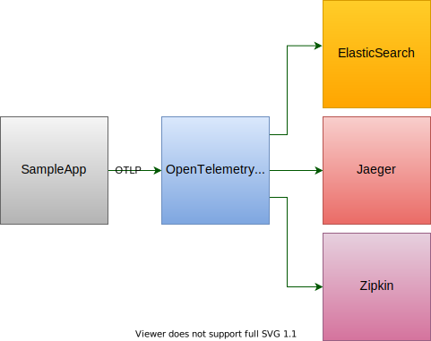

## DbActivities

**DbActivities** is a library that instruments implementations of the following classes from the `System.Data.Common` namespace.

-   DbConnection
-   DbTransaction
-   DbCommand
-   DbDataReader

### How it works

**DbActivities** is implemented using the Decorator pattern mening that it sits between our code and the actual implementations.
This makes it possible to intercept a call to `ExecuteNonQuery` and report information about that call. This information is typically the duration of the call, the SQL statement being executed and so on. Information is collected and reported using the `Activity` class from the `System.Diagnostics` namespace. The advantage of this is that `DbActivities` has no third-party dependencies and we still support things like distributed tracing and exporting OpenTelemetry data.

### OpenTelemetry

OpenTelemetry is an effort to standardise how we export traces, logs and metrics from our applications. This is a huge improvement since we can get rid of any vendor-specific code and just publish our data to an endpoint that understands the OpenTelemetry protocol (OTLP).



As we can see from the picture above the decision of where to actually publish trace, logs and metrics data is moved out of our application and is simply a matter of a configuration during deployment of the system. ElasticSearch, Jaeger and Zipkin are just examples of possible destinations.

So what does it take for our code to trace and make sure that we comply with the OpenTelemetry protocol? Do we have to use some kind of OpenTelemetry tracing API in our code? Actually that would maybe be acceptable to some extent since we now at least use an open standard. But the answer is that we don't need to reference any third-party library. The API we use for tracing is from System.Diagnostics which is already in the framework. Microsoft is among other big players involved in the OpenTelemetry project and made sure that the API in `System.Diagnostics` has the the same or similar semantics as the OpenTelemetry specifications. This means that we can program against built-in API's and still be compliant with OpenTelemetry. Pretty cool, eh?😀

OpenTelemetry also defines a set of naming schemes that should/must be used in different scenarios.

-   https://github.com/open-telemetry/opentelemetry-specification/blob/main/specification/trace/semantic_conventions/database.md
-   https://github.com/open-telemetry/opentelemetry-specification/blob/main/specification/trace/semantic_conventions/exceptions.md

### DbConnection

We start an `Activity` when the \*`InstrumentedDbConnection` is constructed and we end the `Activity` when the it is disposed.
The following tags are added to the `Activity`.

| Tag                  | Value                                                                                                                                                                                                                                                                                                                                                                                                                                                               |
| -------------------- | ------------------------------------------------------------------------------------------------------------------------------------------------------------------------------------------------------------------------------------------------------------------------------------------------------------------------------------------------------------------------------------------------------------------------------------------------------------------- |
| db.system            | The value from the `InstrumentationOptions.System` property. This value should be one of the values described here. https://github.com/open-telemetry/opentelemetry-specification/blob/main/specification/trace/semantic_conventions/database.md. We make no attempt to infer the database system from the connection string or from the underlying provider so this is actually the only value we absolutely need to provide through the `InstrumentationOptions`. |
| db.connection_string | The connection string from the `DbConnection.ConnectionString` property. Note that the `ConnectionString` could include sensitive information like the username or password. If we should need to "sanitise" the `ConnectionString`, we can do this with `InstrumentationOptions.FormatConnectionString`                                                                                                                                                            |
| db.user              | The value from the `InstrumentationOptions.User` property. This value is NOT required.                                                                                                                                                                                                                                                                                                                                                                              |

### DbCommand

We will wrap an `Activity` around the following methods

-   ExecuteNonQuery
-   ExecuteNonQueryAsync
-   ExecuteReader
-   ExecuteReaderAsync
-   ExecuteScalar
-   ExecuteScalarAsync

Note that `ExecuteReader` and `ExecuteReaderAsync` does not include reading/enumerating the reader.

We add the following tags in compliance with this https://github.com/open-telemetry/opentelemetry-specification/blob/main/specification/trace/semantic_conventions/database.md#call-level-attributes

| Tag              | Value                                                                                                                    |
| ---------------- | ------------------------------------------------------------------------------------------------------------------------ |
| db.name          | The value from `InstrumentationOptions.DatabaseName`.                                                                    |
| db.statement     | The value from `DbCommand.CommandText` Use `InstrumentationOptions.FormatCommandText` to sanitise sensitive information. |
| db.operation     | One of the following values. `nonquery`, `scalar` or `reader`                                                            |
| db.rows-affected | This is NOT an OpenTelemetry attribute and is only populated for `ExecuteNonQuery` and `ExecuteNonQueryAsync`            |

`DbConnection` is also a factory for `DbCommand` meaning that we can create a new command using `DbConnection.CreateCommand()`. This will return a provider-specific `DbCommand` and we might need to set any provider-specific properties before executing the command. An example would be for an `OracleCommand` where it is pretty common to set `BindByName = true`. This can easily be done using `InstrumentationOptions.ConfigureDbCommand`.

````c#
var options = new InstrumentationOptions("oracle")
	.ConfigureDbCommand<OracleCommand>(command => command.BindByName = true);

### DbDataReader

We start an `Activity` when the \*`InstrumentedDbDataReader` is constructed and we end the `Activity` when the it is disposed.
The following tags are added to the `Activity`.

| Tag          | Value                                                                                                                                                      |
| ------------ | ---------------------------------------------------------------------------------------------------------------------------------------------------------- |
| db.rows-read | The number of rows read from the reader. Note that this is NOT an OpenTelemetry attribute, but we considered this to be valuable information nevertheless. |

### DbTransaction

The purpose of instrumenting `DbTransaction` is simply to track for how long we keep a transaction open. Transactions should be as short as possible and by tracing this we can easily spot any potential concurrency/locking issues in the database.

We start an `Activity` when the \*`InstrumentedDbDataReader` is constructed and we end the `Activity` when the transaction is disposed. We will add an event , `commit` or `rollback` based upon whether the transaction was committed or rolled back.

### Exceptions

When an exception occurs, OpenTelemetry also specifies that this should be an event called "exception" with the following attributes.

| Tag                  | Value                                                                                                                                                                   |
| -------------------- | ----------------------------------------------------------------------------------------------------------------------------------------------------------------------- |
| exception.type       | The type of the exception                                                                                                                                               |
| exception.message    | The value from the `Exception.Message` property.                                                                                                                        |
| exception.stacktrace | The value from `Exception.ToString()`                                                                                                                                   |
| exception.source     | The value from the `Exception.Source` property. This is NOT an OpenTelemetry attribute, but we add it anyway to provide as much detail about the exception as possible. |

`DbActivites` wraps the following methods in a try/catch block.

-   ExecuteNonQuery
-   ExecuteNonQueryAsync
-   ExecuteReader
-   ExecuteReaderAsync
-   ExecuteScalar
-   ExecuteScalarAsync

### Example

```c#
var sqliteConnection = new SQLiteConnection();
// Set things like the ConnectionString and stuff here
var instrumentationOptions = new InstrumentationOptions(source:"sqlite");
var dbConnection = new InstrumentedDbConnection(sqliteConnection, options);
````

### Enriching Activities

If we should want to "enrich" our activities with additional data such as tags, events or baggage, we can use `InstrumentationOptions.ConfigureActivity` method.

```c#
var options = new InstrumentationOptions()
  .ConfigureActivity(activity => activity.AddTag("customTag", "customTagValue"));
```

`DbActivites` will invoke this just before the activity is ended.

We can also be more specific when enriching/configuring activities. If we need access to the underlying class being instrumented be can use the following methods.

-   ConfigureCommandActivity
-   ConfigureDataReaderActivity
-   ConfigureConnectionActivity
-   ConfigureTransactionActivity

These methods will pass in the object being instrumented. For instance for a command it would look something like this

```c#
var options = new InstrumentationOptions()
  .ConfigureCommandActivity<SQLiteCommand>((activity, command) => activity.AddTag("customTag", "customTagValue"));
```

This will give us the opportunity to modify the activity based on the actual object being instrumented.
